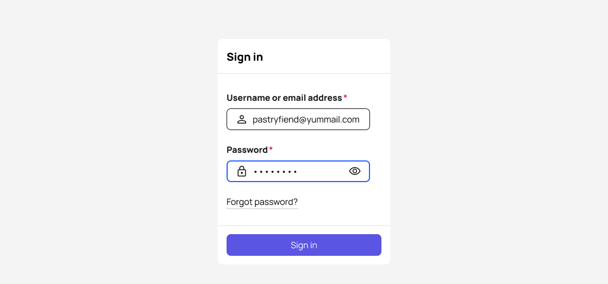
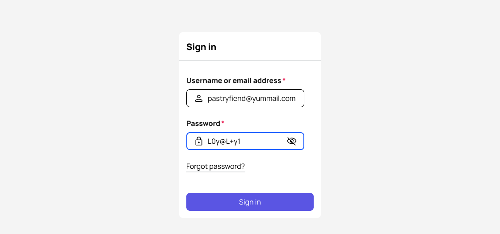

# Password fields and sign in


[**Get the AI skill**](password-fields-and-sign-in.md#ai-skill-file) for this UX pattern guideline in a markdown (.MD) file.


### During sign-in

A sign-in password field captures credentials (a username and masked password) for a sign-in attempt - a one time event (not stored or saved).

#### Blank state

<figure><figcaption>
A blank state sign in form
</figcaption></figure>

Label the username field being as specific as possible to remind users of the likely format. Moreover, label it "email address" if the username is usually an email address. Don't be ambiguous by labeling it username alone.

For the form submit button, use the label “Sign in” to evoke a more friendly, conversational tone. Avoid “Login” except for an exclusively technical audience.

#### Populated state

Masking protects bad actors from gleaning confidential information from the user’s screen, and gives the user psychological confidence their information is protected.

**Masked password**

Mask the password entry by default.

Using the right-most icon from the [form field anatomy](anatomy-of-form-field.md#right-most-icon), provide a toggle for unmasking/masking the password.

<figure><figcaption></figcaption></figure>

**Unmasked password**

<figure><figcaption></figcaption></figure>

***

### During sign-up or account creation


**Strive for very simple password requirements** - for example, at least 8 characters long - and nothing else.

Studies have shown simpler password rules actually boost security by reducing the likelihood a user will need to store the password somewhere in clear text (because the rules make it too hard to memorize), or some other place that exposes an attack vector.


#### With a simple password requirement

With just 1 simple password rule, leverage conventional [form field elements](anatomy-of-form-field.md) for instructions: The [description text](anatomy-of-form-field.md#description-text).

<figure><figcaption></figcaption></figure>

#### With complex password requirements

First, try really, really hard not to have complex password requirements.

Go and push back.

Then push back again.

If you must, show the user each itemized password requirement in a bulleted list format that shows progress as the user types.

Since requirements like these go beyond the scope of the [description text](anatomy-of-form-field.md#description-text), use a callout box styled region just below the password input region to list each requirement vertically.

✅ Show these rules all the time, from the moment the page loads - don't hide waiting for a focus or hover state

✅ Indicate compliance as the user types. Moreover, list all requirements vertically, and change it appearance (like via a checkmark icon) for each requirement as it is met.

🚫 The default state of each requirement should NOT be presented as an error. For example, if using a checkmark to indicate the requirement has been met, use a neutral looking unfilled circle to signal the requirement has NOT been met yet.

🚫 Don’t hide these rules behind a tooltip that depends on a hover state or focus state

🚫 Don’t position it to the side of the input field so that it remains mobile responsive friendly in a narrow viewport, following the single column rule

<figure><figcaption>
An account creation form with complex password requirements. On the left, the user hasn't attempted entering a password yet. On the right, the user has begun to enter a password and met some but not all requirements.
</figcaption></figure>

When there’s a form submission error related to meeting the password requirements, use conventional error validation styles and elements - don’t use the rules region to signal errors. That space is reserved for positivity and progress - not error feedback.

<figure><figcaption>
In this example, the user has attempted to submit the form, but not all password requirements have been met.
</figcaption></figure>

#### Confirm password field

We use a confirm password field to help the user avoid inadvertently typing a password they didn't mean to, leading the inability to access their account.

If using a paired Password + Confirm Password fields, a password validation error related to failure to meet requirements applies to the initial Password field - not the Confirm password field.

The Confirm password field only throws validation errors related to not matching the first password field. "Password doesn't match" is an effective universal error validation message here.

Notably, this is one of the rare exceptions to our [Error Validation guidelines](../form-experience/error-validation.md) where we should validate for password match error the moment the user changes focus to another field (so don't wait for form submission).

***

### Stored passwords

A stored password field is for when the user needs to save a password for use in another context.

A good example of this is an API key, or 3rd party authentication credential for use at a later time.



A stored password field doesn’t fire a sign-in attempt when the form it appears in is submitted - it’s only for storing or saving for use in another context.

<figure><figcaption></figcaption></figure>

1. On the base form page, the user sees a stored password field as a link button.
2. The link button launches a modal window to set and confirm the password.
3. The underlying base form page gets updated text for the link button, indicating the password has been saved.

\
   \
   The link button permits the user to return to #2 if they want to set a brand new password.\
   \
   

The user never gains access to modifying individual portions of a saved password string, masked nor unmasked.

***

### AI skill file


**Don't want to use a markdown file at all?** No problem, just copy URL for this page and paste into your agent. Tell it to use the linked guideline (runtime lookup).

**Don't hard code** the contents of this page to your own skill files though - this page gets updated often.




[Learn how to use](../resources/ai-skills.md) with your favorite AI tool, and get other UX pattern skills.

***

### Sources

#### [Password Creation: 3 Ways to Make it Easier](https://www.nngroup.com/articles/password-creation/)

Nielsen Norman Group, 2015
