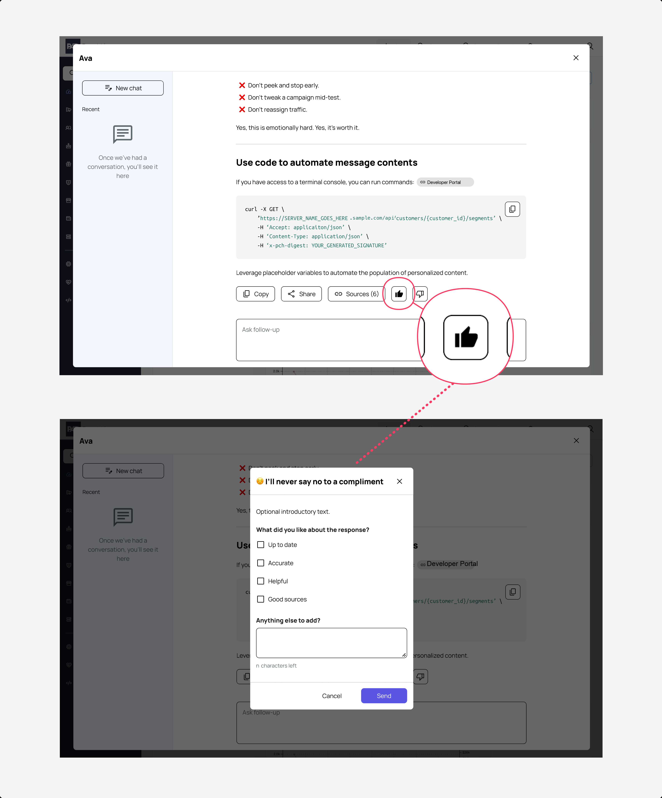

# Modals, lightboxes, and dialogs


[**Get the AI skill**](modals-lightboxes-and-dialogs.md#ai-skill-file) for this UX pattern guideline in a markdown (.MD) file.


### Definitions

A **modal** (also sometimes called "modal dialog" or "modal window") is a UI element that appears on top of the main content ("overlay" generically) and requires the user to interact with it before returning to the underlying interface.

A **lightbox** just means a UI element where the background is dimmed.

There are such things as non-modal lightboxes, and non-lightboxed modals, but the vast majority of our product design calls for a **modal lightbox** as an overlay.

We'll just refer to it as "**modal**" going forward.

<figure><figcaption>
A matrix from Nielsen Norman Group explaining the difference between types of overlays
</figcaption></figure>

### Usage

#### Use a modal to:

(roughly in order of frequency)

✅ warn about irreversible changes (like a [destructive action](../form-experience/destructive-actions-and-deleting.md), or [canceling changes to a form](../form-experience/canceling.md))

✅ break a complex form experience into more focused, digestable chunks

✅ allow the user to focus on a microform while in the midst of a larger form

✅ similarl&#x79;**,** in a form, when adding an array (multiple items of repeated content)

✅ ask for information that could significantly lessen the user’s effort (like declining an onboarding experience)

#### Don't use a modal for:

🚫 entering information that requires referencing other information on the underlying screen

🚫 error dialogs (use in-page error validation instead)

🚫 loading/wait state (use button loading states instead)

🚫 showing a success message

#### Is it okay to have a modal on top of a modal?

Yes, though some situations are more appropriate than others.

✅ There should be no more than 2 layers of modals

✅ The 2nd modal completely covers or replaces the 1st modal (effectively a temporary swap), OR

✅ The 1st modal is nearly a full screen modal, and the 2nd modal much smaller

<figure><figcaption>
This example illustrates an appropriate use of modal over modal: A full-screen chatbot interface contains actions that invoke a smaller nested modal.
</figcaption></figure>

***

### Anatomy

<figure><figcaption></figcaption></figure>

#### Title bar

Always populated, never left blank. Doesn't scroll with body (if body content necessitates scrolling)

#### Body

Content alignment varies by modal utility (see below)

#### Button bar

[Button alignment ](button-alignment.md)varies by modal utility (see below). Doesn't scroll with body (if body content necessitates scrolling)

#### Close button

Always visible and enabled. On a form-style modal, it functions as a Cancel button.

#### Lightbox fade

Clicking or tapping in this region also closes the modal

***

### Page float and centering

<figure><figcaption></figcaption></figure>

Modal windows should be implemented **horizontally centered**, but **vertically using optical centering.**

**Optical centering** strives to put the majority of the content nearer the top edge of the screen where the user's eyes are most likely to be to enhance readability. In other words: Biased toward the top edge of the screen (but always with a margin to maintain separation from the top edge of the viewport).

Some design systems use a rule of thumb where the modal's center is at **35-40% of viewport height** — which naturally creates that optically balanced feel.

### Footprint size

Modals shouldn't span more than 95% of the viewport height and width. Implement scrollbars in the modal body for content beyond that range.

***

### Variations, layouts, and alignments

#### Acknowledgement

<figure><figcaption>
With just 1 or 2 lines of text, centered body content is acceptable
</figcaption></figure>

We use an acknowledgement modal to show useful-to-know information that doesn't warrant persistent visibility directly on the underlying page.

Examples might include (but not limited to) an exhaustive privacy policy or terms of use.

It's often (but not always) surfaced from a text link on the underlying page (again, like Terms of Use or Privacy Policy).

Acknowledgment modals carry just 1 button: "Got it" is a good casual label for it. Acknowledgement buttons often span the width of the modal in a design system.

In the example illustrated in the image above, the body text is just 1-2 lines long, so it can be center aligned.

#### Confirmation prompt

<figure><figcaption>
More than a couple lines of text - like in a Terms of Use agreement or similar - left align content for readability.
</figcaption></figure>

We use confirmation prompts to get active agreement from the user to move forward with something.

In a confirmation prompt's button bar, the user has access to a positive / confirm button ("Let's go" is a good generic casual label for many of these), and a decline/cancel button to back out ("Cancel" or "Nevermind" make good labels here).

In many design systems these 2 buttons span the full width of the modal, each taking about half the width.

A [destructive action like deleting](../form-experience/destructive-actions-and-deleting.md) is good example that should invoke a confirmation prompt, and also carries its own pattern for safely [labeling its buttons](../form-experience/destructive-actions-and-deleting.md#anatomy-of-a-delete-confirmation-dialog).

In the example illustrated in the image above, the body text is 3+ lines long, so it's left-aligned for readability.

#### 1-field form

<figure><figcaption>
A modal form with exactly 1 field permits centered body content.
</figcaption></figure>

Sometimes we need to invoke a modal for populating just a single field.

With a single field, center align the field.

The button alignment should follow [button alignment guidelines](button-alignment.md#modal-forms).

#### Multi-field form

<figure><figcaption>
With more than 1 field, all body content is left aligned.
</figcaption></figure>

When faced with populating a complex form with nested information or an array, we can surface entry fields in a modal window.

Follow [button alignment guidelines](button-alignment.md#single-page-forms) for the button bar on a modal form.

With more 2+ fields in a modal form, the body contents (the fields) are left aligned.

#### Multi-step form

<figure><figcaption>
Finally, in a <a href="../form-experience/multi-step-forms.md">multi-step form </a>we use our <a href="../form-experience/multi-step-forms.md#navigation-bar">conventional multi-step form navigational button cluster</a>
</figcaption></figure>

Filling out forms in a modal window should still follow guidelines for when a [multi-step form](../form-experience/multi-step-forms.md) is appropriate.

Refer to [button alignment guidelines](button-alignment.md#multi-step-forms) for this type of modal, too.

***

### AI skill file


**Don't want to use a markdown file at all?** No problem, just copy URL for this page and paste into your agent. Tell it to use the linked guideline (runtime lookup).

**Don't hard code** the contents of this page to your own skill files though - this page gets updated often.




[Learn how to use](../resources/ai-skills.md) with your favorite AI tool, and get other UX pattern skills.

***

### Sources

#### [Modal & Nonmodal Dialogs: When (& When Not) to Use Them](https://www.nngroup.com/articles/modal-nonmodal-dialog/)

Nielsen Norman Group, 2017

#### [Popups: 10 Problematic Trends and Alternatives](https://www.nngroup.com/articles/popups/)

Nielsen Norman Group, 2019
