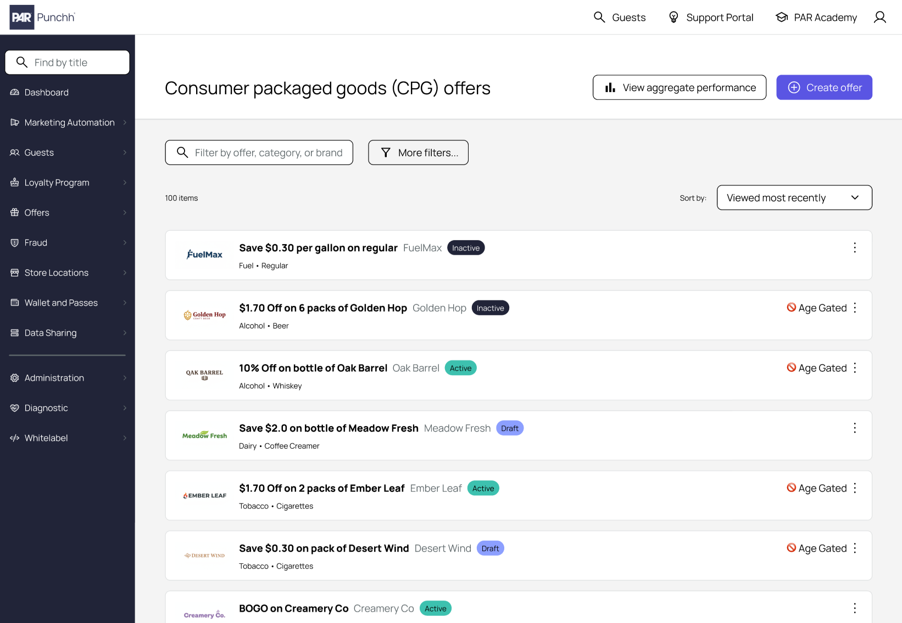

# Cards


[**Get the AI skill**](cards.md#ai-skill-file) for this UX pattern guideline in a markdown (.MD) file.


<figure><figcaption></figcaption></figure>

A card is merely a UI "container" used to group related information together, separate from other content.

Like a card in the real world, they're almost always square or rectangular in shape (along with any other aesthetic styles and flourishes defined by your design system).

Cards are usually served up in multiples, with each card following the same pattern for whatever content contained within. This helps the user better recognize which information across cards is of the same type or category.

While cards of the same type should follow the same pattern, that pattern is highly variable depending on project and context, so we won't attempt to be prescriptive about those elements here.

Instead, we'll focus on the interactions and behaviors that should be common across cards, regardless of content.

***

### When to use a card

Unlike a callout box that is almost exclusively used to house read-only reference information and usually stands alone, a card is _often_ is interactive (but not always), and/or comes in multiples (to convey an array of related information).

#### Form design

<figure><figcaption>
In this example, the user has built an array of 2 items in modal windows (not shown), and they manifest here on the underlying form as cards.
</figcaption></figure>

Cards are great for representing an array of repeated entries with the same information structure and hierarchy.

In a classic card implementation for items in a form:

1. On a form page, the user encounters a field that permits adding multiple "items", each with multiple fields.
2. In a modal window, the user enters information about the item
3. When done entering information, the user closes or saves the modal
4. The "item" is then manifested as a card on the underlying form page
5. The user can click the card to make edits

#### Ranked list fields

<figure><figcaption>
A ranked list field that uses cards for each item - the user can drag cards up or down to set the desired ranking.
</figcaption></figure>

Cards work well when users need to rank items in a list via drag and drop. By containing the ranked information inside of a card, users find it easy to track and recognize which items are being moved up or down.

Using cards also gives the user something tangible to "grab onto" while dragging (especially when using a "grabber dots" icon button.

#### Lists or tables

<figure><figcaption>
A list view where each item in the table is represented as a card rather than a traditional table with inflexible columns and cells.
</figcaption></figure>

Cards can also be used to represent the items in the list (as opposed to classic table rows). Cards are better than traditional table rows and cells at supporting:

* images and rich visual content (table cells are too small to showcase imagery)
* longer form text and highly variable text values (table columns are too tiny and would cause too much truncation or wrapping)

The user can click the card to view details of that item (by either navigating to a details page or sliding out a side panel).

#### Navigation portals

<figure><figcaption></figcaption></figure>

On landing pages or navigation portals, use cards to represent major navigational items.

* The user can click a card to navigate to the desired page

If each card merely provides navigation to the page name already identified in the card's title text (common in a business application) then there's probably no need for CTA buttons on each card.

#### Dashboards

<figure><figcaption></figcaption></figure>

Cards are a great way to separate groups of information on a dashboard from each other. From data metrics to data visualizations, use cards as a container to facilitate scalability and drag-and-drop customization.

***

### Anatomy

#### Context menu button

<figure><figcaption></figcaption></figure>

This element is applicable mainly to cards in a form array, and sometimes for cards as list items in a table.

In an array of cards where each card has 1 or more utility actions (like Edit, Delete, Duplicate, etc.), a context menu on each card is a great way to facilitate access. We wouldn't want these actions visible all the time as their use is an exception case, and so not to be redundant across cards.

Use an icon button (commonly 3 vertical dots) in the top-right corner of the card to access the context menu.

#### Call to action buttons

<figure><figcaption></figcaption></figure>

While the entire container of a card can often provide navigation by itself, some contexts warrant surfacing an explicit call to action (CTA) button to inspire sign ups or some monetization transaction.

Imagine a restaurant website with a card for featured menu items.

Including a CTA button like "order now" might increase conversion rate moreso than no CTA at all.

#### Text and image content

This is the highly variable part that we can't be too prescriptive for.

We can't predict what your content will be for every context, so just be sure to use distinct hierarchies to distinguish elements from one another.

If the card has a short title, use a subheading element. If there are multiple pieces of metadata, use different font weights, and/or subdued/muted font colors to establish a consistent hierarchy across cards that allow the user to quickly scan and discern common data across cards.

***

### Interactivity

The entire card is a single clickable/tappable element (EXCEPT sometimes in a [Ranked List Field](../entering-information/ranked-list-fields.md)) as long as there are no buttons on the card (not counting the context menu icon button, if present. That can remain an independent interactive element).


Be sure to give the user visual feedback when using a mouse and hovering over the card body to signal that it's interactive. Some design systems accomplish this with a shadow effect on hover.


If there is 1 or more button on the card, then the broader card is _not_ interactive, as the buttons drive all interactions now, and we don't want to create a conflict.

🚫 **Don't put hyperlinked text in a card**

Cards are intended to facilitate large click areas with highly accessible targets. Hyperlinked text is the opposite of a large, easily clickable region.

***

### AI skill file


**Don't want to use a markdown file at all?** No problem, just copy URL for this page and paste into your agent. Tell it to use the linked guideline (runtime lookup).

**Don't hard code** the contents of this page to your own skill files though - this page gets updated often.




[Learn how to use](../resources/ai-skills.md) with your favorite AI tool, and get other UX pattern skills.
